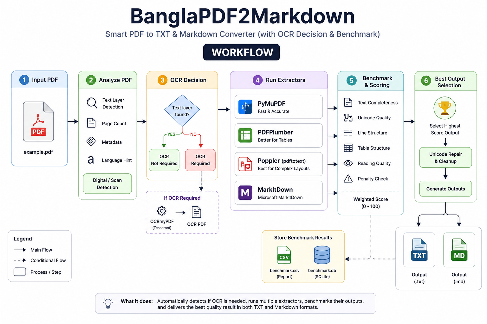
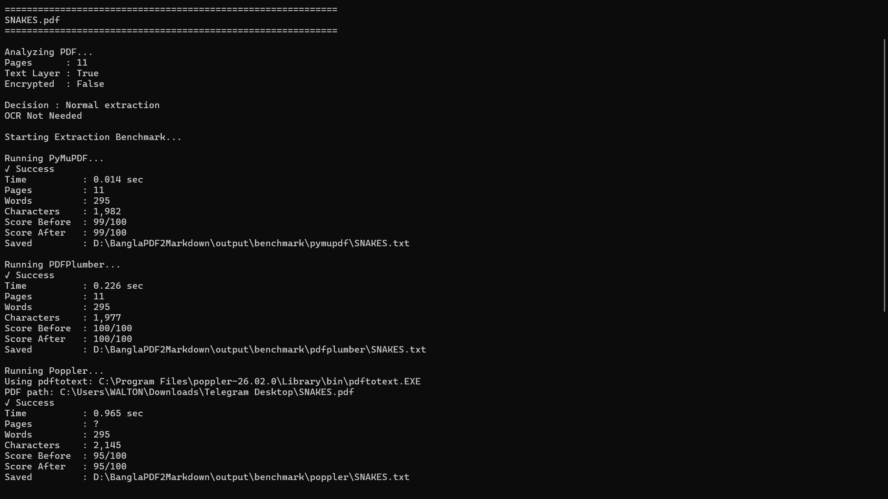
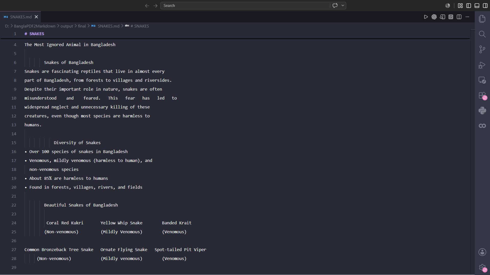

# BanglaPDF2Markdown


Smart **Bangla PDF → Markdown** extraction with automatic OCR decision,
benchmarking, Unicode repair and best-result selection.

------------------------------------------------------------------------

## Table of Contents

-   Features
-   Workflow
-   Installation
-   Usage
-   Screenshots
-   Supported Extractors
-   Project Structure
-   Output
-   Roadmap
-   Contributing
-   License
-   Author

------------------------------------------------------------------------

## Features

-   Automatic PDF analysis
-   Smart OCR detection (OCRmyPDF)
-   Multiple extraction engines
-   Automatic benchmarking
-   Quality scoring
-   Bangla Unicode repair
-   TXT and Markdown output
-   CSV & SQLite benchmark logging

------------------------------------------------------------------------

## Workflow



The pipeline analyzes the PDF, decides whether OCR is needed, runs
multiple extractors, benchmarks the results, repairs Bangla Unicode when
necessary, and selects the highest-quality output.

------------------------------------------------------------------------

## Installation

``` bash
git clone https://github.com/hello-hmemon/BanglaPDF2Markdown.git
cd BanglaPDF2Markdown

python -m venv .venv
.venv\Scripts\activate

pip install -r requirements.txt
```

### Requirements

-   Python 3.11+
-   Tesseract OCR
-   OCRmyPDF
-   Poppler (pdftotext)

------------------------------------------------------------------------

## Usage

``` bash
python app.py "D:\PDFs\sample.pdf"
```

### Terminal Example



------------------------------------------------------------------------

## Example Markdown Output



------------------------------------------------------------------------

## Supported Extractors

  Extractor             Purpose
  --------------------- ---------------------------------
  PyMuPDF               Fast text extraction
  PDFPlumber            Layout-aware extraction
  Poppler (pdftotext)   Excellent plain text and tables
  MarkItDown            Markdown-oriented extraction

------------------------------------------------------------------------

## Project Structure

``` text
BanglaPDF2Markdown/
├── bp2md/
├── extractors/
├── docs/
│   └── images/
├── tests/
├── app.py
├── requirements.txt
├── pyproject.toml
└── README.md
```

------------------------------------------------------------------------

## Output

Generated files may include:

-   Final TXT
-   Final Markdown
-   Benchmark CSV
-   Benchmark SQLite database

------------------------------------------------------------------------

## Roadmap

-   Better table reconstruction
-   Batch processing
-   HTML report
-   DOCX export
-   GUI (future)

------------------------------------------------------------------------

## Contributing

Contributions are welcome. Please read **CONTRIBUTING.md** before
submitting issues or pull requests.

------------------------------------------------------------------------

## License

This project is released under the **MIT License**.

------------------------------------------------------------------------

## Author

**HM Emon**

GitHub: https://github.com/hello-hmemon
